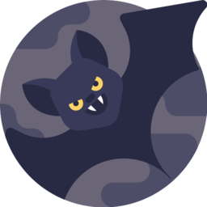

<div align="center">

[](#)
[](https://www.gnu.org/licenses/gpl-3.0)
[](https://github.com/AndreBFarias/Dracula_OS-Theme/releases/latest)
[](https://www.gnu.org/software/bash/)
[](https://www.python.org/)
[](https://pop.system76.com/)
[](https://github.com/AndreBFarias/Dracula_OS-Theme/stargazers)
[](https://github.com/AndreBFarias/Dracula_OS-Theme/issues)

<div align="center">
<div style="text-align: center;">
  <h1 style="font-size: 2.2em;">Dracula_OS-Theme</h1>
  
</div>
</div>

</div>

---

### Descrição

Experiência Dracula unificada para **Pop!_OS / GNOME** em um único monorepo portátil: ícones (2235 arquivos), cursor, tema GTK, tema do shell e temas internos de aplicativos (kitty, qBittorrent, Spotify via Spicetify, GNOME Terminal, Obsidian, Telegram, Discord, OnlyOffice). Build reprodutível, install/uninstall reversível, backups automáticos.

Desenvolvido e testado em **Pop!_OS 22.04 LTS / GNOME 42.9 / X11**.

---

### Principais Funcionalidades

| Categoria | Funcionalidade |
|-----------|---------------|
| **Tema de ícones** | `Dracula-Icones` com herança de `dracula-icons-main` + `dracula-icons-circle` (fallback total de sistema) |
| **Mapeamento declarativo** | `mapping.json` com 203 apps, gerado automaticamente a partir dos `.desktop` do sistema |
| **Aliases humanos** | 48 apps ganham slugs amigáveis (`whatsapp`, `discord`, `apostrophe`) além do reverse-DNS |
| **Mimetypes custom** | Ícones Dracula para `.md`, `.sh`, `.desktop`, `.mp4` (cobrindo 16 convenções XDG) |
| **Multiplas resoluções** | PNGs em 16, 22, 24, 32, 48, 64, 128, 256 px gerados via `rsvg-convert` ou ImageMagick |
| **Cursor** | `Dracula-Cursor` preservado |
| **Tema GTK (2/3/4)** | `Dracula-standard-buttons` com override shell para Pop!_OS Launcher |
| **Pop!_Shell + Pop!_Cosmic** | Substitui `dark.css` das duas extensões por versão Dracula (com backup) |
| **App themes** | kitty, qBittorrent, GNOME Terminal (dconf), Spicetify/Spotify, Obsidian (itera vaults), Telegram, Discord (BetterDiscord/Vesktop/Vencord), OnlyOffice |
| **Overrides `.desktop`** | ZapZap → "WhatsApp" com ícone próprio; Snap `whatsapp-linux-app` oculto por `NoDisplay` para evitar duplicata |
| **Normalização** | `scripts/normalizar_desktops.sh` reescreve `Icon=<path_absoluto>` para `Icon=<app_id>` (com backup) |
| **Limpeza segura** | `scripts/limpar_duplicatas.sh` remove `Dracula-*` antigos com backup em `~/.cache/dracula_os_backup_<ts>/` |
| **Release reprodutível** | `scripts/release.sh` gera tarball + SHA256 |
| **Integração Spellbook-OS** | `rebuild_dracula_theme` + cobertura de `~/.local/share/icons/` em `_reconstruir_caches_icones` |

---

### Instalação

#### Via Script (Recomendado — clona o repo completo)

```bash
git clone https://github.com/AndreBFarias/Dracula_OS-Theme.git ~/Desenvolvimento/Dracula_OS-Theme
cd ~/Desenvolvimento/Dracula_OS-Theme

./scripts/baixar_upstreams.sh          # baixa dracula-icons-main/circle (~120MB, git-ignored)
python3 scripts/extrair_mapeamento.py  # gera mapping.json a partir dos .desktop do sistema
./build.sh                             # gera dist/ com ícones em todos os tamanhos
./install.sh --user --all              # instala + ativa + app-themes + pop-shell-css
```

#### Via Release (tarball)

```bash
wget https://github.com/AndreBFarias/Dracula_OS-Theme/releases/latest/download/Dracula_OS-Theme-v1.1.0.tar.gz
tar xzf Dracula_OS-Theme-v1.1.0.tar.gz
cd Dracula_OS-Theme-v1.1.0

./scripts/baixar_upstreams.sh
./build.sh
./install.sh --user --all
```

#### Flags do install.sh

```bash
./install.sh --user             # instala em ~/.local/share/ (sem ativar)
./install.sh --system           # instala em /usr/share/ (requer sudo)
./install.sh --user --activate  # instala + ativa via gsettings
./install.sh --user --app-themes         # instala + aplica temas internos de apps
./install.sh --user --pop-shell-css      # instala + substitui dark.css das extensões (requer sudo)
./install.sh --user --sounds             # instala tema de som Pop + ativa via gsettings
./install.sh --user --keybindings        # aplica snapshot de atalhos + silencia shutter
./install.sh --user --gnome-extensions   # reinstala + configura 13 extensões GNOME
./install.sh --user --all                # tudo acima
```

---

### Requisitos

**Obrigatórios:**
- Pop!_OS 22.04+ ou qualquer GNOME 42+
- `bash`, `python3` (>= 3.10), `jq`
- `gtk-update-icon-cache` (pacote `libgtk-3-bin`)
- `rsvg-convert` (pacote `librsvg2-bin`) **ou** `imagemagick` (fallback)

**Opcionais:**
- `sassc` (para recompilar SCSS do tema GTK)
- Extensão GNOME `user-theme` (aplicar tema shell)
- Extensão GNOME `pop-shell@system76.com` + `pop-cosmic@system76.com` (recursos específicos do launcher)

---

### Componentes instalados

```
~/.local/share/icons/Dracula-Icones/          # 2235 arquivos (203 apps × 8 tamanhos + aliases + mimetypes)
~/.local/share/icons/Dracula-Cursor/
~/.local/share/icons/dracula-icons-main/      # upstream (herança)
~/.local/share/icons/dracula-icons-circle/    # upstream (herança)
~/.local/share/themes/Dracula-standard-buttons/
~/.local/share/applications/com.rtosta.zapzap.desktop                  # override WhatsApp
~/.local/share/applications/whatsapp-linux-app_whatsapp-linux-app.desktop  # Snap oculto (NoDisplay)

# Com --pop-shell-css:
/usr/share/gnome-shell/extensions/pop-shell@system76.com/dark.css       (backup em .orig)
/usr/share/gnome-shell/extensions/pop-cosmic@system76.com/dark.css      (backup em .orig)

# Com --app-themes:
~/.config/kitty/current-theme.conf            # Dracula oficial
~/.themes/dracula.qbtheme                     # qBittorrent
~/.var/app/md.obsidian.Obsidian/config/obsidian/<vault>/.obsidian/themes/Dracula/
~/.config/BetterDiscord/themes/Dracula.theme.css    # (se instalado)
~/.cache/dracula-telegram/dracula.tdesktop-theme    # importar manualmente no Telegram
# Spicetify aplicado via Spellbook-OS (tema Sleek + color scheme Dracula)
# GNOME Terminal perfil importado via dconf
```

---

### Arquitetura do repositório

```
Dracula_OS-Theme/
├── README.md
├── LICENSE                     # GPL-3.0
├── CHANGELOG.md
├── docs/
│   ├── CONTRIBUTING.md
│   └── sprints/
│       ├── INDEX.md
│       ├── SPRINT_01_POS_UPGRADE.md
│       └── SPRINT_02_TRANSPARENCIA.md
├── assets/
│   └── logo.png                # gerado a partir de src/icons/new-sessao-atual/bat.svg
├── catalog.json                # descrição dos 295 SVGs estilizados (categorias, cores, tamanhos)
├── mapping.json                # 203 apps → ícone (revisável manualmente)
├── build.sh                    # SVG → PNGs + index.theme + caches
├── install.sh                  # --user | --system | --all | --activate | --app-themes | --pop-shell-css
├── uninstall.sh
│
├── src/
│   ├── icons/
│   │   ├── upstream/           # (git-ignored) via scripts/baixar_upstreams.sh
│   │   ├── current/            # 3437 SVGs customizados + PNGs 48×48
│   │   ├── new-sessao-atual/   # 295 SVGs estilizados gótico/fantasia
│   │   └── projects/           # 19 ícones de projetos pessoais
│   ├── shell/
│   │   ├── pop-shell-dracula.css  # regras anexadas ao gnome-shell.css
│   │   ├── pop-shell-dark.css     # substitui dark.css do Pop!_Shell
│   │   └── pop-cosmic-dark.css    # substitui dark.css do Pop!_Cosmic
│   └── sounds/
│       └── Pop/                # tema de som Pop!_OS (26 .oga do upstream)
│
├── app-themes/                 # kitty, qBittorrent, terminal, spicetify, obsidian, telegram, discord, onlyoffice
│   ├── keybindings/            # dconf snapshots (media-keys, terminal, sound)
│   └── gnome-extensions/       # manifesto das 13 extensões + dconf dumps
├── overrides/                  # .desktop overrides (ZapZap → WhatsApp, Snap oculto)
├── dist/                       # (git-ignored) saída do build
└── scripts/
    ├── baixar_upstreams.sh
    ├── extrair_mapeamento.py
    ├── gerar_catalog.py
    ├── renomear_fontes.py
    ├── normalizar_desktops.sh
    ├── limpar_duplicatas.sh
    ├── aplicar_overrides.sh
    ├── instalar_app_themes.sh
    ├── instalar_pop_shell_css.sh
    ├── instalar_sons.sh
    ├── capturar_keybindings.sh
    ├── instalar_keybindings.sh
    ├── capturar_gnome_extensions.sh
    ├── instalar_gnome_extensions.sh
    ├── debug_launcher.sh
    └── release.sh
```

---

### Build pipeline

O `build.sh` executa em ordem:

1. Limpa `dist/`
2. Copia upstreams (`dracula-icons-{main,circle}`) para `dist/icons/` como temas independentes
3. Gera `Dracula-Icones` a partir de `mapping.json`:
   - Para cada app, copia SVG/PNG-fonte como `{app_id}` e cada `{alias_humano}`
   - Gera PNG em 8 tamanhos via `rsvg-convert` (fallback: `magick`/`convert`)
4. Gera mimetypes custom (`.md`, `.sh`, `.desktop`, `.mp4`) em múltiplos nomes XDG
5. Escreve `index.theme` com `Inherits=dracula-icons-circle,dracula-icons-main,Adwaita,hicolor`
6. Copia cursor e tema GTK
7. Concatena `src/shell/pop-shell-dracula.css` ao `gnome-shell.css` do tema (inline — GNOME Shell não suporta `@import`)
8. Roda `gtk-update-icon-cache -f -t` nos três temas

---

### Desinstalação

```bash
./uninstall.sh --user           # remove tudo que foi instalado no user
./uninstall.sh --system         # versão sudo
```

Reverte automaticamente:
- Temas em `~/.local/share/{icons,themes}/`
- Overrides `.desktop` em `~/.local/share/applications/`
- `dark.css` original de Pop!_Shell e Pop!_Cosmic (de `.orig`)

Depois, resete temas via `gsettings`:
```bash
gsettings reset org.gnome.desktop.interface icon-theme
gsettings reset org.gnome.desktop.interface gtk-theme
gsettings reset org.gnome.desktop.interface cursor-theme
```

---

### Troubleshooting

**Ícones não aparecem após instalar**
```bash
gtk-update-icon-cache -f ~/.local/share/icons/Dracula-Icones
update-desktop-database ~/.local/share/applications
```
Depois: `Alt+F2` → `r` → Enter (X11) ou logout/login (Wayland).

**Apps com `Icon=` path absoluto quebraram**
```bash
./scripts/normalizar_desktops.sh --dry-run   # preview
./scripts/normalizar_desktops.sh             # aplica (backup automático)
```

**Launcher do Pop!_OS continua opaco**
Veja [docs/sprints/SPRINT_02_TRANSPARENCIA.md](docs/sprints/SPRINT_02_TRANSPARENCIA.md) para o estado da investigação e próximos passos.

**Spicetify reclama de versão mismatched**
Normal após update do Spotify Flatpak. Reaplicar:
```bash
~/Desenvolvimento/Spellbook-OS/scripts/spicetify-setup.sh
```

---

### Limpeza de instalações antigas

Se você tem instalações Dracula espalhadas de configurações anteriores (`~/.icons/Dracula-Icones/`, `~/.icons/Dracula-Icons/`, etc.), rode depois de instalar o novo tema:

```bash
./scripts/limpar_duplicatas.sh --dry-run   # preview do que será removido
./scripts/limpar_duplicatas.sh             # interativo (pede confirmação)
./scripts/limpar_duplicatas.sh --yes       # sem confirmação
```

Guards automáticos:
- Bloqueia se o novo tema não estiver instalado
- Avisa se `.desktop` com path absoluto ainda não foram normalizados
- Backup automático em `~/.cache/dracula_os_backup_<timestamp>/`

Preserva `~/.local/share/icons/dracula-icons-{main,circle}/` (os upstreams que o novo tema herda).

---

### Integração com Spellbook-OS

Se você usa o [Spellbook-OS](https://github.com/AndreBFarias/Spellbook-OS):

- A função `_reconstruir_caches_icones` (em `functions/sistema.zsh`) agora cobre também `~/.local/share/icons/`
- Nova função `rebuild_dracula_theme` roda `build.sh` + `install.sh --user` em um passo

```zsh
rebuild_dracula_theme         # reconstrói e reinstala
rebuild_dracula_theme --all   # reconstrói, reinstala, ativa, aplica app-themes
```

---

### Documentação

- [Índice de Sprints](docs/sprints/INDEX.md) — histórico de decisões e trabalho em andamento
- [Guia de Contribuição](docs/CONTRIBUTING.md) — padrão de commits, estrutura de features, checklist de PR
- [Changelog](CHANGELOG.md) — histórico de versões

---

### Licença

Distribuído sob a licença **GPL-3.0**. Veja [LICENSE](LICENSE) para detalhes.

---

### Créditos

- **Dracula Theme** — paleta oficial: https://draculatheme.com
- **`m4thewz/dracula-icons`** — upstream principal
- **`m4thewz/dracula-icons-circle`** — upstream circle
- **`dracula/vesktop-discord`** — tema Discord
- **`dracula/obsidian`** — tema Obsidian
- **`dracula/telegram`** — tema Telegram
- **`spicetify/spicetify-themes`** — temas Spotify
- **Sessão artística** de 295 SVGs estilizados gótico/fantasia para ampliar cobertura
